<div align="center">

# 🌍🤖 Awesome World Labs Robotics

**The Definitive Resource for Spatial Intelligence in Robotics**  
*Powered by [World Labs](https://www.worldlabs.ai/)*

[](https://platform.worldlabs.ai)
[](LICENSE)
[](https://www.python.org/)
[]()

[**📚 Documentation**](https://docs.worldlabs.ai) | [**🚀 Get Started**](#-quick-start) | [**🐙 GitHub Repo**](https://github.com/pgeedh/WorldLab-RoboticsExamples)

</div>

---

## 📖 About
**WorldLab Robotics Examples** bridges the gap between **Generative AI** and **Embodied Intelligence**. Traditional simulations are too sterile; real-world data is too expensive. We use **World Labs' Large World Models (LWMs)** to generate "Physically Grounded Digital Twins"—chaotic, photorealistic, and 3D-consistent environments engineering-grade spatial reasoning.

Whether you are testing a **quadruped on a construction site**, a **manipulator in a messy bedroom**, or a **social robot in a hotel lobby**, this repository provides the "Digital Twin" blueprints you need.
Physical intelligence requires physical data. This repository leverages the **World Labs API** to generate unlimited, photorealistic, and 3D-consistent environments ("Digital Twins") for robotics training—ranging from domestic chores to complex industrial assembly.

## 📸 Visual Catalog & High-Fidelity Prompts
Below are the "Digital Twin" blueprints available in this repository. Each prompt is engineered for specific robotics vision and interaction tasks.

### 🏠 Domestic & Residential

#### Domestic Kitchen (Robotics Training)
> **Prompt**: "A hyper-realistic, robot-centric digital twin of a modern domestic kitchen. Captured from a 1.2m height (robot eye level). Key interaction zones include a granite island with specific grasping targets..."

[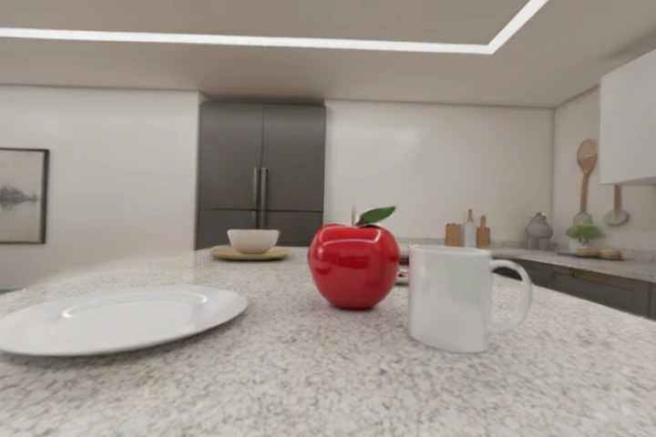](https://marble.worldlabs.ai/world/3b294e60-e6d7-4f69-8d7a-d3b11db89c56)
👉 **[Click to Explore 3D World](https://marble.worldlabs.ai/world/3b294e60-e6d7-4f69-8d7a-d3b11db89c56)**

#### Cluttered Bedroom (Manipulation)
> **Prompt**: "A physically simulated messy bedroom for high-complexity manipulation training... A tangled pile of laundry (red t-shirt, blue jeans, white socks) rests on an unmade bed..."

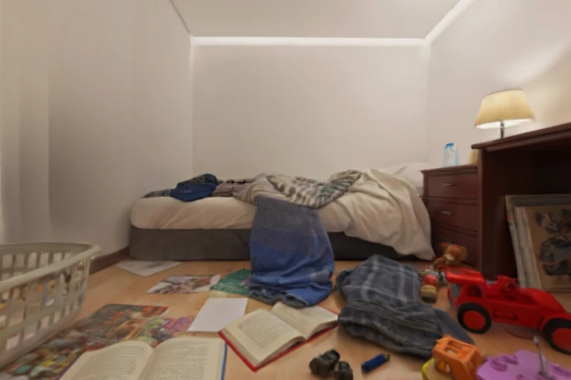
*Run generation script to create interactive world.*

#### Messy Airbnb (Housekeeping)
> **Prompt**: "A 'lived-in' living room state for housekeeping robots. An open suitcase sits on a rug, spilling patterned clothing... The scene tests the robot's ability to distinguish between 'trash' and 'personal items'..."

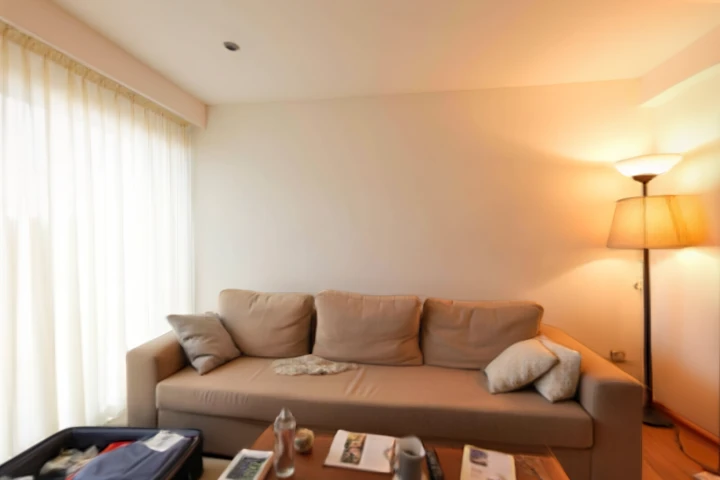
*Run generation script to create interactive world.*

### 🏭 Industrial & Logistics

#### Industrial Warehouse (Navigation)
> **Prompt**: "A precision-mapped industrial warehouse aisle. High-contrast yellow safety lines painted on polished concrete floors. Metal racking units... Fiducial markers (QR codes) visible on shelf edges..."

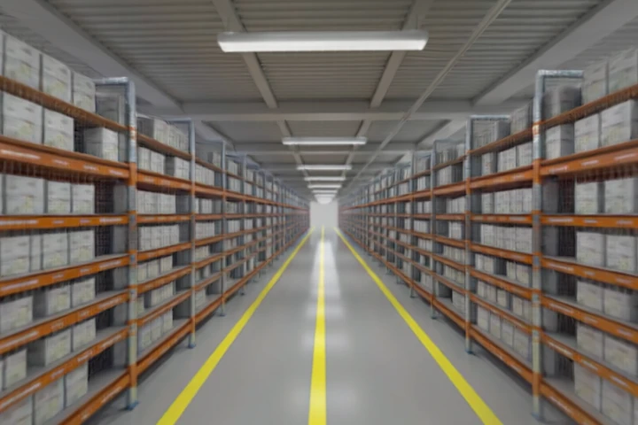
*Run generation script to create interactive world.*

#### PCB Assembly Line (Fine Motor)
> **Prompt**: "Macro-photography view of an electronics assembly workbench. A green PCB (Printed Circuit Board) is clamped in a holder... Nearby components: a tray of tiny 0402 resistors..."

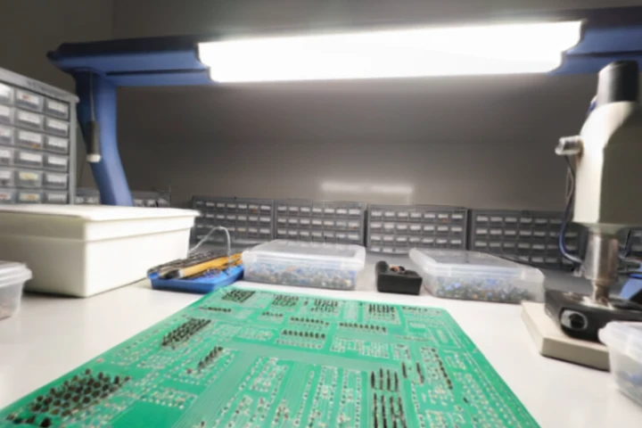
*Run generation script to create interactive world.*

#### Data Center (Cable Maintenance)
> **Prompt**: "**System Role:** Senior Simulation Engineer specializing in Deformable Linear Objects (DLOs)... **Objective:** Generate a high-fidelity 3D simulation environment for 'Data Center Cable Remediation'..."


*Run generation script to create interactive world.*

#### Automotive Robotic Cell (Welding)
> **Prompt**: "A heavy-industry automotive welding cell. A raw steel car chassis acts as the central workspace. Orange industrial robotic arms (KUKA-style)... Sparks from a spot welder are frozen in mid-air..."

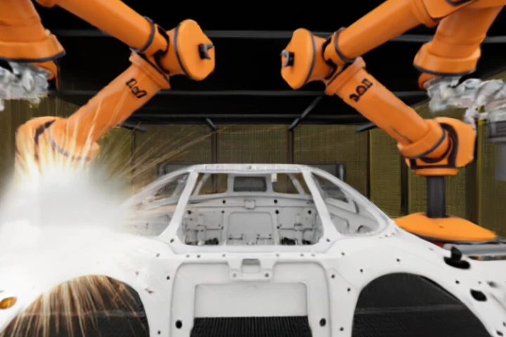
*Run generation script to create interactive world.*

### 🏥 Service & Commercial

#### Hotel Reception (Concierge)
> **Prompt**: "A 5-star hotel lobby designed for social navigation. Polished marble floors reflecting the environment... The space is populated with 'ghost' proxies of people... Luggage carts with brass railings..."

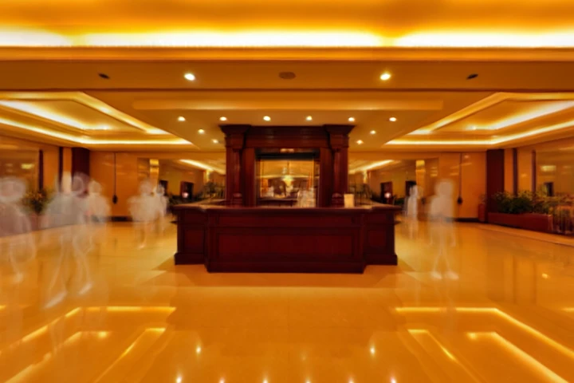
*Run generation script to create interactive world.*

#### Restaurant Dining (Crowded Nav)
> **Prompt**: "A dense restaurant dining floor layout. Round tables covered in white cloth... Chairs are pulled out at irregular angles, narrowing the navigation path to <60cm. Ambient lighting is dim/moody..."

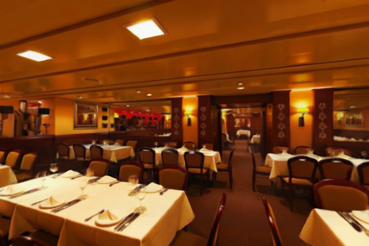
*Run generation script to create interactive world.*

#### Hospital Corridor (Delivery)
> **Prompt**: "A sterile, bright hospital corridor. High-gloss vinyl flooring. Walls are white with color-coded wayfinding strips. Obstacles include a crash cart... Lighting is clinical fluorescent..."

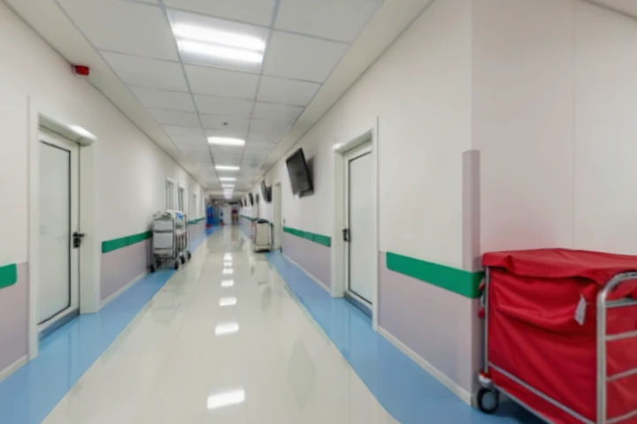
*Run generation script to create interactive world.*

#### Supermarket Shelves (Inventory)
> **Prompt**: "A planogram-compliant supermarket aisle. Shelves are fully stocked with colorful cereal boxes... Several items are intentionally missing (out-of-stock) to test gap detection. Price tags on the shelf edge are legible..."

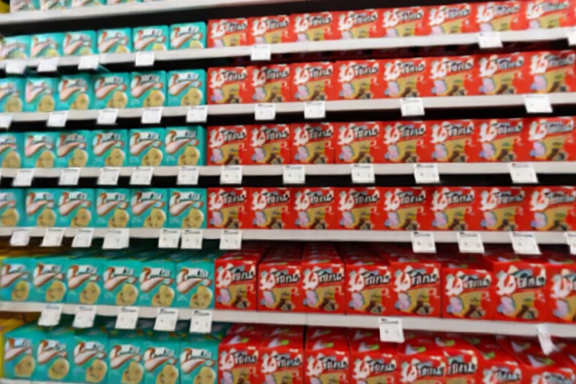
*Run generation script to create interactive world.*

### 🚧 Outdoor & Unstructured

#### City Sidewalk (Delivery Rover)
> **Prompt**: "First-person view from a delivery rover on a city sidewalk. Paved concrete slabs with cracks and chewing gum stains. A fire hydrant (red) and a parking meter (gray) act as static obstacles..."

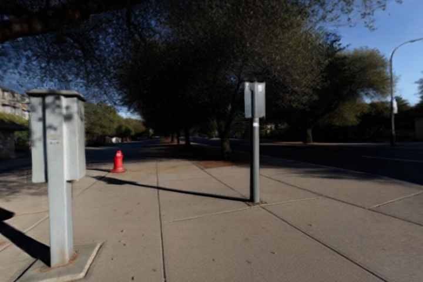
*Run generation script to create interactive world.*

#### Construction Site (Quadruped Locomotion)
> **Prompt**: "An active chaotic construction site. Ground is uneven, covered in loose gravel and sand. Piles of red bricks and wooden pallets create traversability barriers. Exposed steel rebar acts as a snagging hazard..."

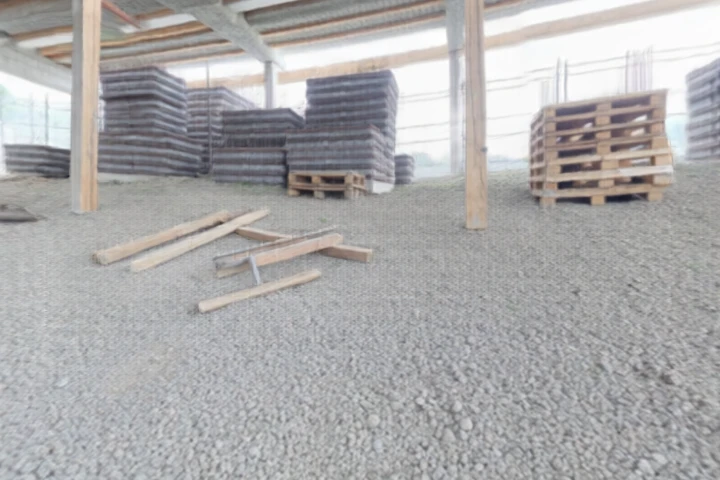
*Run generation script to create interactive world.*

#### Disaster Zone (Search & Rescue)
> **Prompt**: "A simulated post-earthquake rubble pile. Broken slabs of concrete, twisted rebar, and shattered glass... Atmospheric dust/haze reduces visibility to 80%. Lighting is low-angle, simulating dusk..."

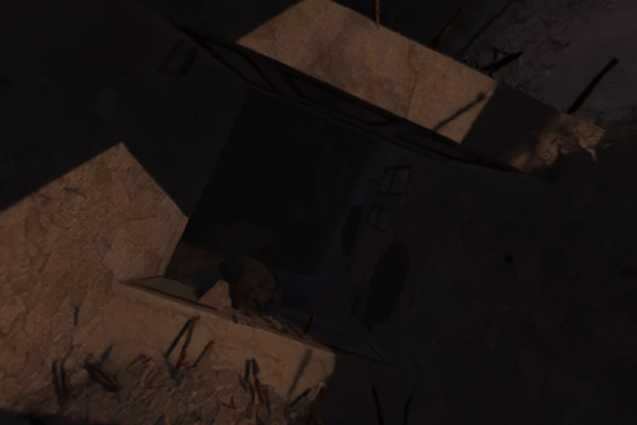
*Run generation script to create interactive world.*

#### Agricultural Field (Perception)
> **Prompt**: "A robotic agriculture perception dataset. Parallel rows of green corn crops, approximately 1.5m high. The inter-row path is dirt with random weeds. Sunlight is directly overhead (noon)..."

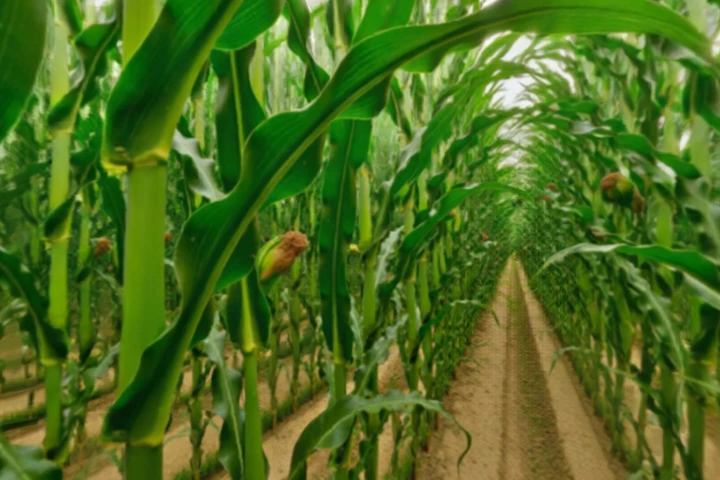
*Run generation script to create interactive world.*

---

## 📂 Repository Structure

- **`scripts/`**:
    - `generate_with_api.py`: **(Core Tool)** A powerful script pre-loaded with 15+ robotics scenarios to generate 3D worlds on demand.
- **`prompts/`**:
    - `core_collection.json`: Structured JSON tasks linked to specific environments (e.g., "Plug in ethernet cable" -> "Data Center").
- **`worlds/`**:
    - `api_renders/`: The output directory where your generated world thumbnails and assets are saved.

## ⚡ Quick Start

### 1. Prerequisite
You need a [World Labs Platform](https://platform.worldlabs.ai) account and API key.

1. Create a `.env` file:
   ```bash
   cp .env.example .env
   ```
2. Add your key:
   ```
   WLT_API_KEY=wl_...
   ```

### 2. Generate Worlds
We have automated the creation of reference environments. Run the script to generate verified scenarios:

```bash
# Generates all configured scenarios using the World Labs API
python3 scripts/generation/generate_with_api.py
```

*Note: This utilizes the `Marble 0.1-mini` model for speed and efficiency.*

### 3. Use the Prompts
Load our structured prompts to test your robot's reasoning against these worlds.
```python
import json
with open("prompts/core_collection.json", "r") as f:
    tasks = json.load(f)

# Example: Get a task for the Data Center environment
cable_task = [t for t in tasks[1]["prompts"] if t["id"] == "manip_cable_01"][0]
print(f"Task: {cable_task['task']}")
```

## 🤝 Contributing
Have a new robotics use case?
1. Fork the repo.
2. Add your scenario to `generate_with_api.py`.
3. Add a corresponding task to `prompts/core_collection.json`.
4. Submit a Pull Request!

## 📜 License
MIT License.

---

<div align="center">
  <b>Made with ❤️ by <a href="https://github.com/pgeedh">Pruthvi Geedh</a></b>
</div>
